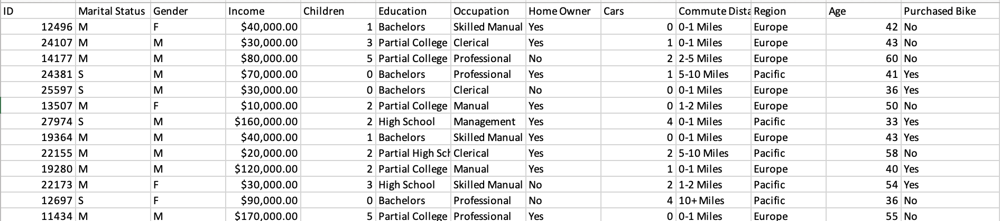
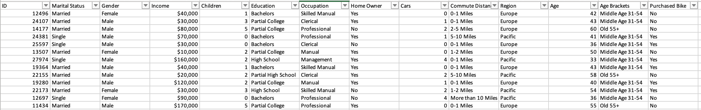
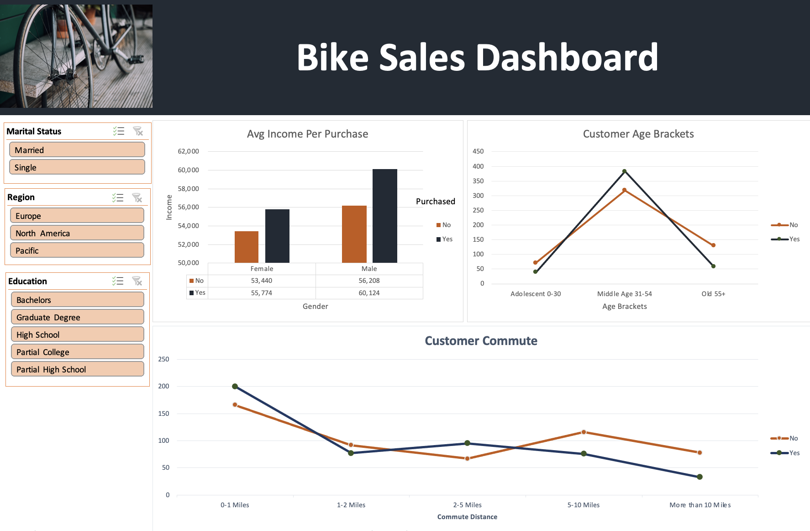

# Bike-Sales-Dashboard

## Initial Analysis 

We got raw data from a bike sales shop, with some information related to their customers, as the following image depicts. 

## Data Cleaning

To ensure that our data is ready to use, we remove duplicates, transform some data description (Marital Status (S / M) and Gender (M / F) to complete words (Single / Married) & (Male / Female))
and binning the age to different groups to simplify the visualizations.

## Visualization

Three different pivot tables were created and from each one a chart that represents each summary, joined by different filter slicers our dashboard takes shape and 
it's ready to go.

Work done thanks to Alex The Analyst (https://www.youtube.com/watch?v=opJgMj1IUrc)
